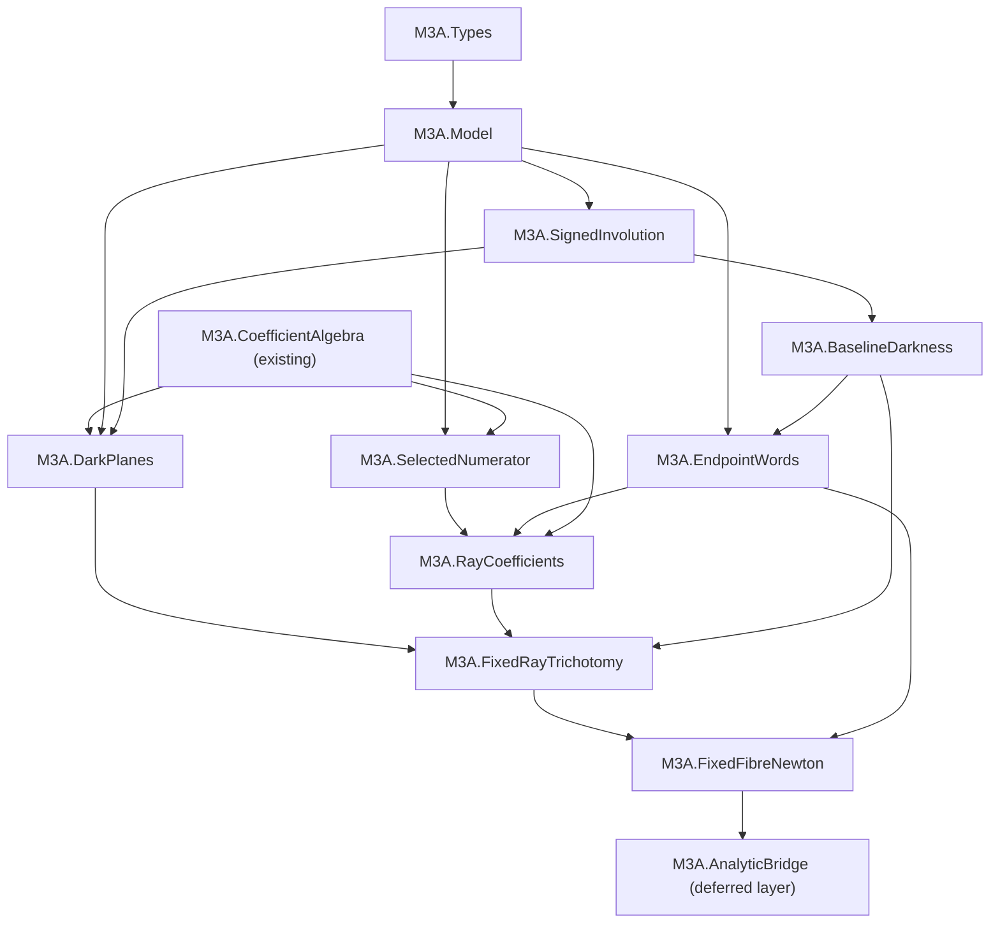

# M3A theorem-to-Lean dependency map

Status: implementation blueprint for the first formalisation phase  
Date: 4 August 2026  
Lean project: `%USERPROFILE%\Documents\M3AFormalisation`  
Toolchain: Lean/Mathlib `v4.32.1`

## 1. Scope and source authority

This map covers exactly the requested spine:

1. signed involutions and baseline darkness;
2. the exact selected numerator;
3. the dark-plane decomposition;
4. endpoint-access word support;
5. the fixed-ray trichotomy;
6. the fixed-fibre Newton theorem.

The statement authority is the integrated flagship paper, Sections 2--7, under
the source root

`C:\Users\skilo\Documents\My Work (papers & maths)\M3A work - Copy`.

The primary files are:

- `M3A_PAPER_II_INTEGRATED_FLAGSHIP/PAPER/sections/02_model_and_channel.tex`;
- `M3A_PAPER_II_INTEGRATED_FLAGSHIP/PAPER/sections/03_exact_numerator_and_ideal.tex`;
- `M3A_PAPER_II_INTEGRATED_FLAGSHIP/PAPER/sections/04_syzygy_dark_planes_certificates.tex`;
- `M3A_PAPER_II_INTEGRATED_FLAGSHIP/PAPER/sections/05_endpoint_support.tex`;
- `M3A_PAPER_II_INTEGRATED_FLAGSHIP/PAPER/sections/06_fixed_direction_trichotomy.tex`;
- `M3A_PAPER_II_INTEGRATED_FLAGSHIP/PAPER/sections/07_fixed_fibre_newton.tex`;
- `M3A_PAPER_II_INTEGRATED_FLAGSHIP/THEOREM_SOURCE_MAP.csv`;
- `M3A_PAPER_II_INTEGRATED_FLAGSHIP/FORMULA_SOURCE_MAP.csv`;
- `M3A_PAPER_II_INTEGRATED_FLAGSHIP/NOTATION_LOCK.md`.

The source-to-Lean traceability is:

| Paper source | Mathematical statement | Principal Lean target |
|---|---|---|
| R1.2 model lock | signed involutions and baseline darkness | `baseline_moments_dark` |
| T3.1 / F02 | exact selected numerator | `selectedNumerator_formula` |
| T4.1 / F04 | reduced union of two dark planes | `ell_quad_zero_iff_planes` |
| T5.1 / F05 | endpoint-access word support and boundary | `momentCoeff_eq_zero_of_lt_endpoint`, `sixState_boundary_ray` |
| T6.1 / F06--F07 | complete fixed-ray trichotomy | `fixedRay_trichotomy` |
| T7.1 | fixed-fibre Newton polyhedra | `fixedFibre_newton` |

The exact supporting authorities are TF1's numerator and dark-component files,
EA1's endpoint-word theorem, and NP1's Newton-fibre theorem. The current Lean
project already contains the proved algebraic syzygy
`M3A.coefficient_syzygy`; it is the first completed dependency node.

This phase stops at the fixed-fibre theorem. It does not include moving analytic
arcs, monomial pullbacks, the universal multivariate atlas, Groebner/Rees data,
or the fixed-weight Noetherian theorem.

## 2. Formalisation architecture

The safest architecture has two layers.

### Layer A: exact finite algebra

This is the first implementation target. It uses finite matrices, exact
polynomial identities, finite word sums and coefficient support. It proves the
full branch classification without relying on numerical approximation.

### Layer B: analytic interpretation

This later layer identifies the formal amplitude coefficients with the Taylor
coefficients of the complex matrix exponential. It turns the exact support
theorems into the paper's analytic statements about `K_v(epsilon,t)` and its
Newton polyhedron.

The split is important: the theorem's mathematical core is finite and
algebraic, while matrix-exponential analyticity introduces additional API and
convergence obligations that should not block the exact certificate layer.

## 3. Proposed Lean module graph



Recommended files:

| Module | Responsibility |
|---|---|
| `M3A/Types.lean` | `Fin 6` states, `Fin 4` internal coordinates, source/target indices, direction notation |
| `M3A/Model.lean` | locked `H0`, diagonal perturbation, `H(d)`, selected moments |
| `M3A/SignedInvolution.lean` | abstract signed-certificate theorem and the two locked signed permutations |
| `M3A/BaselineDarkness.lean` | Krylov recurrence and all baseline selected moments equal zero |
| `M3A/CoefficientAlgebra.lean` | existing `ell`, `quad`, `cubicCoeff`, syzygy; later notation adapters |
| `M3A/SelectedNumerator.lean` | selected cofactor and exact numerator identity |
| `M3A/DarkPlanes.lean` | pointwise plane decomposition, optional ideal equality, plane certificates |
| `M3A/EndpointWords.lean` | word expansion, endpoint support, six-state boundary coefficient |
| `M3A/RayCoefficients.lean` | perturbation/time coefficient array and the first surviving coefficients |
| `M3A/FixedRayTrichotomy.lean` | mutually exclusive linear/quadratic/dark classification |
| `M3A/FixedFibreNewton.lean` | support orthants, Newton fibres and positive-weight exposed vertex |
| `M3A/AnalyticBridge.lean` | deferred matrix-exponential/Taylor-series identification |

## 4. Shared definitions and conventions

### 4.1 Finite indices

Use named finite types rather than untyped natural numbers:

```lean
abbrev State := Fin 6
abbrev Internal := Fin 4

def source : State := 0
def target : State := 5
```

The paper's internal coordinates `d1,...,d4` correspond to Lean indices
`0,...,3`. This conversion must occur in one function only.

### 4.2 Locked matrix orientation

Use matrices whose row is the receiving state and whose column is the sending
state. The selected moment is therefore

```lean
def selectedMoment (H : Matrix State State K) (k : Nat) : K :=
  (H ^ k) target source
```

This fixes the cofactor orientation: the selected adjugate entry deletes row
`source = 0` and column `target = 5`, with sign `(-1)^(0+5) = -1`.

### 4.3 Coordinate forms

The current four-argument definitions are correct. Add tuple adapters without
changing the existing theorem:

```lean
def linearCoeff (d : Internal -> K) : K := ell (d 0) (d 1) (d 2) (d 3)
def quadraticCoeff (d : Internal -> K) : K := quad (d 0) (d 1) (d 2) (d 3)
def cubicNumeratorCoeff (d : Internal -> K) : K :=
  cubicCoeff (d 0) (d 1) (d 2) (d 3)
```

In prose and theorem names, reserve `L`/`linearCoeff` for actual coordinates
and `ell` for a declared fixed ray. Do not use `R` for a remainder or Rees
object.

### 4.4 Formal amplitude coefficients

Before introducing analysis, define exact coefficients by moments:

```lean
def rayMomentCoeff (v : Internal -> K) (p q : Nat) : K := ...

def amplitudeCoeff (v : Internal -> Complex) (p q : Nat) : Complex :=
  ((-Complex.I) ^ q / q.factorial) * rayMomentCoeff v p q
```

The exact implementation may use coefficients of a polynomial matrix in
`epsilon`, or the equivalent finite word sum. The two definitions should be
proved equal.

## 5. Dependency node A: signed involutions and baseline darkness

### A1. Abstract certificate

Formalise the model-independent Paper I implication with a module endomorphism,
a source vector and a target linear functional.

Suggested structure (API names may be adjusted during implementation):

```lean
structure SignedCertificate
    (A : Module.End K V) (b : V) (c : V ->ₗ[K] K) where
  sigma : Module.End K V
  involutive : sigma * sigma = 1
  commutes : Commute sigma A
  source_even : sigma b = b
  target_odd : c.comp sigma = -c
```

Core theorem:

```lean
theorem selectedMoment_eq_zero_of_signedCertificate
    [Field K] (h2 : (2 : K) ≠ 0)
    (cert : SignedCertificate A b c) (k : Nat) :
    c ((A ^ k) b) = 0
```

Proof dependencies:

1. commutation of `sigma` with every power of `A`;
2. the source is `+1` under `sigma`;
3. the target functional is `-1` under precomposition by `sigma`;
4. the selected moment equals its negative;
5. `(2 : K) ≠ 0` forces it to be zero.

The involution law records the certificate semantics, although the vanishing
calculation uses commutation and opposite characters directly.

### A2. Locked certificates

Define `rOrig` and `rAlt` by basis action:

- `rOrig`: `0 -> +0`, `5 -> -5`, `1 <-> 2`, `3 <-> 4`;
- `rAlt`: `0 -> +0`, `5 -> -5`, `1 <-> 4`, `2 <-> 3`.

Finite verification lemmas:

```lean
theorem rOrig_involutive : rOrig * rOrig = 1
theorem rAlt_involutive : rAlt * rAlt = 1
theorem rOrig_commutes_H0 : Commute rOrig H0
theorem rAlt_commutes_H0 : Commute rAlt H0
```

These are appropriate for `ext`, `fin_cases`, `simp` and `norm_num`; no search
or external certificate is needed.

### A3. Baseline darkness

Primary locked theorem:

```lean
theorem baseline_moments_dark (k : Nat) :
  selectedMoment H0 k = 0
```

Independent finite-dimensional strengthening:

```lean
theorem H0_sq_source :
  H0 ^ 2 * sourceVec = 4 • sourceVec + 2 • (H0 * sourceVec)

theorem source_krylov_eq :
  krylovSpace K H0 sourceVec =
    Submodule.span K {sourceVec, H0 * sourceVec}
```

The first baseline proof should use `rOrig`; the Krylov recurrence provides an
independent exact check and later finite-certification support.

Analytic corollary, deferred to Layer B:

```lean
theorem baseline_amplitude_dark (t : Real) :
  selectedAmplitude H0 t = 0
```

### A gate

- Both signed matrices square to the identity.
- Both commute with `H0`.
- `baseline_moments_dark` compiles for every `k` with no finite-depth cutoff.
- No matrix-exponential theorem is required for the gate.

## 6. Dependency node B: exact selected numerator

### B1. Locked family

Define the actual-coordinate perturbation and Hamiltonian:

```lean
def diagonalPerturbation (d : Internal -> K) : Matrix State State K := ...
def hamiltonian (d : Internal -> K) : Matrix State State K :=
  H0.map ... + diagonalPerturbation d
```

Define `spectralMatrix z d = z • 1 - hamiltonian d`.

### B2. Selected cofactor

Avoid any ambiguity in `Matrix.submatrix` by defining explicit embeddings for
the five retained rows and columns. Then define

```lean
def selectedNumerator (z : K) (d : Internal -> K) : K :=
  - Matrix.det (selectedMinor (spectralMatrix z d))
```

The sign is part of the theorem, not a post-hoc convention.

### B3. Exact formula

Target theorem over a commutative ring:

```lean
theorem selectedNumerator_formula [CommRing K]
    (z : K) (d : Internal -> K) :
    selectedNumerator z d =
      linearCoeff d * (z ^ 2 + 2 * z) +
      2 * quadraticCoeff d * (z + 1) +
      cubicNumeratorCoeff d
```

This is the actual-coordinate formula. The fixed-ray formula is a corollary
after substituting `d = epsilon • v`:

```lean
theorem selectedNumerator_ray_formula [CommRing K]
    (z epsilon : K) (v : Internal -> K) :
    selectedNumerator z (epsilon • v) =
      epsilon * ellV v * (z ^ 2 + 2 * z) +
      2 * epsilon ^ 2 * quadV v * (z + 1) +
      epsilon ^ 3 * cubicV v
```

Proof strategy:

1. expand the explicit `5 x 5` determinant by a fixed Laplace/Leibniz route;
2. simplify all finite indices;
3. close the remaining universal polynomial identity with `ring`;
4. retain the exact equality before any numerator/denominator reduction.

Do not make a grid evaluation or external symbolic output an axiom. Such output
may be used only as a development-time cross-check.

### B4. Coefficient consequences

Reuse the existing theorem to prove:

```lean
theorem cubic_eq_neg_linear_quadratic ... :
  cubicV v = -(v 1 + v 3) * quadV v - (v 1 * v 3) * ellV v

theorem cubic_eq_zero_of_ell_quad_zero ...
    (hL : ellV v = 0) (hQ : quadV v = 0) :
    cubicV v = 0
```

Optional algebraic-geometry extension:

```lean
theorem numerator_coefficient_ideal : I_N = Ideal.span {Lpoly, Qpoly}
```

The ideal theorem is not required before the fixed-ray trichotomy, because the
pointwise coefficient implications suffice.

### B gate

- The cofactor sign and retained indices are unit-tested.
- The formula is proved universally, not by interpolation.
- The ray formula and the existing syzygy agree definitionally after adapters.

## 7. Dependency node C: dark-plane decomposition

### C1. Pointwise decomposition first

Define:

```lean
def OnPlaneA (v : Internal -> K) : Prop := v 0 = v 1 ∧ v 2 = v 3
def OnPlaneB (v : Internal -> K) : Prop := v 0 = v 3 ∧ v 2 = v 1
```

Core theorem over an integral domain:

```lean
theorem ell_quad_zero_iff_planes [CommRing K] [IsDomain K]
    (v : Internal -> K) :
    ellV v = 0 ∧ quadV v = 0 <-> OnPlaneA v ∨ OnPlaneB v
```

Proof spine:

1. solve `ellV v = 0` for the first coordinate;
2. rewrite `quadV v` as `(v 1 - v 2) * (v 3 - v 2)`;
3. use no-zero-divisors to split the factors;
4. reconstruct the two plane equalities;
5. prove both reverse directions by `ring`/substitution.

The pointwise proof appears valid over any integral domain. To remain aligned
with the manuscript, the first public theorem may retain its stated
characteristic-not-two/field hypothesis and a later theorem may expose the
stronger Lean generalisation.

### C2. Certificate planes

Show that the signed symmetries persist under the matching diagonal
perturbation:

```lean
theorem rOrig_commutes_hamiltonian_of_planeA (h : OnPlaneA v) :
  Commute rOrig (rayHamiltonian epsilon v)

theorem rAlt_commutes_hamiltonian_of_planeB (h : OnPlaneB v) :
  Commute rAlt (rayHamiltonian epsilon v)
```

Then obtain exact darkness on each plane from node A. This is the preferred
all-moment proof for the dark branch: it avoids deriving an infinite sequence
solely from a rational-function identity.

### C3. Ideal equality second

The manuscript also states

`(L,Q) = (d1-d2,d3-d4) intersect (d1-d4,d3-d2)`.

Formalise this later in `MvPolynomial Internal K` using `Ideal.span` and
intersection. It is valuable for the reduced-locus claim but not a prerequisite
for the coefficient-support trichotomy.

### C gate

- Pointwise decomposition is proved both directions.
- Each plane has its own explicit signed certificate.
- The common scalar line satisfies both plane predicates.
- No converse is inferred merely from failure of one certificate.

## 8. Dependency node D: endpoint-access word support

This node should be built in two stages: the locked six-state theorem first,
then the fully reusable EA1 theorem.

### D1. Word representation

For `j` perturbation letters, represent a word by:

- a label sequence `i1,...,ij`;
- `j+1` non-negative gaps of `A0` letters;
- a proof that the gap sum is `k-j`.

This gap representation mirrors the exact EA1 formula and avoids quotienting
arbitrary lists by content.

Define `wordEval` in source-to-target order so that it evaluates

`C A0^aj V_ij ... V_i1 A0^a0 B`.

Separately define a list/free-word expansion and prove the two enumerations
equivalent. This supplies an internal check that every word occurs exactly
once.

### D2. General coefficient formula

Use a finite multi-index `gamma : Internal ->₀ Nat` (or a finite function with
sum) and define the matrix coefficient of `delta^gamma`.

Target theorem:

```lean
theorem momentCoeff_eq_wordSum ... :
  momentCoeff A0 V B C gamma k =
    ∑ compatible labelled gaps, wordEval ...
```

The theorem is field-algebraic and uses no Hermiticity or graph assumptions.

### D3. Endpoint depths and boundary

Define source and target access predicates first. Add `WithTop Nat` minima only
after the predicate-level lemmas compile.

Core support theorem:

```lean
theorem momentCoeff_eq_zero_of_lt_endpoint
    (hj : gamma.sum = j) (hk : k < j + rho gamma) :
    momentCoeff A0 V B C gamma k = 0
```

Boundary theorem:

```lean
theorem momentCoeff_boundary :
  momentCoeff A0 V B C gamma (j + rho gamma) = boundarySum ...
```

Sharpness is `boundarySum ≠ 0`, not merely existence of a non-zero candidate
word. This distinction must be encoded because endpoint-minimal words can
cancel.

### D4. Locked six-state specialisation

For `V_r = E_rr`, prove every label has source and target depth one:

```lean
theorem internal_source_depth (r : Internal) : sourceDepth r = 1
theorem internal_target_depth (r : Internal) : targetDepth r = 1
```

Then:

```lean
theorem sixState_support_bound
    (gamma : Internal ->₀ Nat) (hpos : gamma.sum ≠ 0)
    (hk : k < gamma.sum + 2) :
    momentCoeff H0 diagLetter sourcePort targetPort gamma k = 0
```

At the boundary there is one ray-level word, `H0 * D(v)^j * H0`, giving:

```lean
theorem sixState_boundary_ray (v : Internal -> K) (j : Nat) :
  rayMomentCoeff v j (j + 2) =
    v 0 ^ j - v 1 ^ j + v 2 ^ j - v 3 ^ j
```

The positive-degree hypothesis is essential. `j = 0` belongs to baseline
darkness and must not be smuggled into the endpoint theorem.

### D gate

- Word orientation is tested on `k = 3, j = 1` and `k = 4, j = 2`.
- The six-state support theorem proves `k < j+2` vanishing.
- Boundary coefficients give `ell` and `2Q` at `(1,3)` and `(2,4)`.
- Candidate-word existence and coefficient non-cancellation remain distinct.

## 9. Dependency node E: fixed-ray trichotomy

### E1. Branch datatype

```lean
inductive RayBranch
| linear
| quadratic
| dark
```

Define `classifyRay v` by the predicates `ellV v ≠ 0`, then
`quadV v ≠ 0`, otherwise dark. Prove the three predicates are pairwise
disjoint and exhaustive before proving coefficient content.

### E2. Required coefficient lemmas

1. Baseline layer: `rayMomentCoeff v 0 q = 0` for every `q` (node A).
2. Endpoint lower bound: positive support satisfies `q >= p+2` (node D).
3. Linear boundary: `rayMomentCoeff v 1 3 = ellV v` (node D).
4. Quadratic boundary: `rayMomentCoeff v 2 4 = 2 * quadV v` (node D).
5. Complete first-order vanishing under `ellV v = 0`.
6. Complete darkness under `ellV v = 0` and `quadV v = 0`.

Item 5 is the main bridge obligation. Preferred proof route:

- take the `epsilon`-linear part of the exact selected numerator;
- use the transformed formal resolvent at `x = z^-1` with the required
  `x^-1` shift;
- show its denominator has constant coefficient one and is therefore a formal
  unit;
- conclude that `ell = 0` removes every first-order moment, not only the
  boundary moment.

Item 6 should use node C's explicit plane certificates after the pointwise
decomposition. The numerator/syzygy route can be retained as an independent
second proof.

### E3. Exact coefficient theorem

First prove the formal-support form:

```lean
theorem fixedRay_trichotomy (v : Internal -> Real) :
  (ellV v ≠ 0 ∧
      firstSupport (amplitudeCoeff v) = some (1, 3) ∧
      amplitudeCoeff v 1 3 = Complex.I * ellV v / 6)
  ∨
  (ellV v = 0 ∧ quadV v ≠ 0 ∧
      firstSupport (amplitudeCoeff v) = some (2, 4) ∧
      amplitudeCoeff v 2 4 = quadV v / 12)
  ∨
  (ellV v = 0 ∧ quadV v = 0 ∧
      support (amplitudeCoeff v) = ∅)
```

It may be cleaner in Lean to state three branch theorems plus one exhaustive
wrapper instead of one large disjunction.

Layer B then supplies the paper-facing analytic corollary:

- linear: the support lies in `(1,3) + N^2`, with coefficient
  `i*ell/6` at the unique lower vertex `(1,3)`;
- quadratic: the support lies in `(2,4) + N^2`, with coefficient
  `Q/12` at the unique lower vertex `(2,4)`;
- dark: `K_v` is identically zero.

The no-cubic conclusion is family-specific and follows because the first two
coefficient conditions force the dark branch via the syzygy and plane
decomposition.

### E gate

- Protected test direction `(1,0,-1,0)` evaluates to `ell = 0`, `Q = 1` and
  amplitude coefficient `1/12`.
- All first-order coefficients vanish in the quadratic branch.
- All coefficients vanish in the dark branch.
- No theorem quantifies over a direction depending on `epsilon`.

## 10. Dependency node F: fixed-fibre Newton theorem

### F1. Exact support object

Define actual coefficient support:

```lean
def fibreSupport (v : Internal -> Real) : Set (Nat × Nat) :=
  {(p, q) | amplitudeCoeff v p q ≠ 0}

def upperOrthant (u : Nat × Nat) : Set (Nat × Nat) :=
  {w | u.1 <= w.1 ∧ u.2 <= w.2}
```

Do not define support from candidate words. Coefficient cancellation has already
been accounted for in `amplitudeCoeff`.

### F2. Support-shape theorem

This is the exact combinatorial heart of the Newton theorem:

```lean
theorem fibreSupport_shape (v : Internal -> Real) :
  if ellV v ≠ 0 then
    (1, 3) ∈ fibreSupport v ∧ fibreSupport v ⊆ upperOrthant (1, 3)
  else if quadV v ≠ 0 then
    (2, 4) ∈ fibreSupport v ∧ fibreSupport v ⊆ upperOrthant (2, 4)
  else
    fibreSupport v = ∅
```

This theorem depends only on the trichotomy and endpoint support.

### F3. Positive-weight exposed vertex

Prove a reusable order lemma:

```lean
theorem unique_positiveWeight_minimizer
    (ha : 0 < a) (hb : 0 < b)
    (hu : u ∈ S) (hS : S ⊆ upperOrthant u) :
    ∀ w ∈ S, w ≠ u ->
      b * u.1 + a * u.2 < b * w.1 + a * w.2
```

Coercions from natural exponents to `Real` should be isolated in the weight
function.

### F4. Newton polyhedron

Define the paper's polyhedron over `Real × Real` as the convex hull of the
embedded support plus the non-negative quadrant. Then prove the general lemma:

```lean
theorem newton_eq_orthant_of_vertex
    (hu : u ∈ S) (hS : S ⊆ upperOrthant u) :
    newtonPolyhedron S = realUpperOrthant u
```

The proof uses both directions:

- support containment gives the upper bound;
- the present vertex plus the added quadrant gives the reverse inclusion;
- the upper orthant is already convex.

Apply it to obtain:

```lean
theorem fixedFibre_newton (v : Internal -> Real) :
  newtonPolyhedron (fibreSupport v) =
    if ellV v ≠ 0 then realUpperOrthant (1, 3)
    else if quadV v ≠ 0 then realUpperOrthant (2, 4)
    else ∅
```

The zero-germ convention must be explicit: empty coefficient support gives the
empty Newton polyhedron.

### F gate

- Generic fibre: `(1,3) + R_nonnegative^2`.
- Protected non-dark fibre: `(2,4) + R_nonnegative^2`.
- Dark fibre: empty.
- Every strictly positive weight exposes the displayed vertex uniquely.
- The transformed-resolvent bridge uses `x^-1 G(x^-1;epsilon)`; omitting the
  shift is a test failure because it moves the time index by one.

## 11. Milestones and acceptance tests

| Milestone | New modules | Acceptance theorem/build |
|---|---|---|
| M0: model lock | `Types`, `Model` | exact `H0` entries and port indices evaluate correctly |
| M1: baseline | `SignedInvolution`, `BaselineDarkness` | `baseline_moments_dark` for all `k` |
| M2: numerator | `SelectedNumerator` | universal selected-cofactor formula over a commutative ring |
| M3: dark geometry | `DarkPlanes` | pointwise plane equivalence and both persistent certificates |
| M4: word support | `EndpointWords` | `k<j+2` vanishing and boundary power-sum formula |
| M5: coefficients | `RayCoefficients` | `(1,3)` coefficient `i*ell/6`; `(2,4)` coefficient `Q/12` |
| M6: trichotomy | `FixedRayTrichotomy` | exactly linear, quadratic or dark; no cubic branch |
| M7: Newton fibre | `FixedFibreNewton` | two orthants or empty; positive-weight uniqueness |
| M8: analytic bridge | `AnalyticBridge` | formal coefficients equal Taylor coefficients of the matrix exponential |

Every milestone must satisfy:

```text
lake env lean <new-module>.lean
lake build
#print axioms <principal theorem>
```

No milestone may use `sorry`, `admit`, user-declared axioms, `unsafe`, or an
external symbolic computation as a trusted theorem.

## 12. Risk and scope firewall

1. **Cofactor orientation:** delete row 0 and column 5 and include the negative
   cofactor sign. Reversing row/column conventions can silently flip or select
   the wrong channel.
2. **Unreduced numerator:** prove the cofactor identity before rational
   reduction. Cancellation may alter poles but not create a non-zero entry from
   a zero unreduced numerator.
3. **Actual versus ray coordinates:** keep `d` separate from `v` and keep `v`
   fixed independently of `epsilon` in the trichotomy.
4. **Baseline versus positive degree:** EA1's endpoint theorem starts at
   positive perturbation degree. Baseline darkness is a separate node.
5. **Words versus coefficients:** endpoint-minimal words may cancel. Newton
   support uses surviving coefficient sums only.
6. **Numerator order versus time depth:** the ordered pair `(p,q)` is essential.
   Neither coordinate determines the other.
7. **First-order protected branch:** `ell = 0` must remove the complete
   first-order moment sequence, not only the `(1,3)` coefficient.
8. **No cubic branch:** this is exact only for the declared four-parameter
   diagonal family.
9. **Characteristic:** determinant/syzygy identities are integral; signed
   parity cancellation requires `2 ≠ 0`; pointwise factor splitting requires
   no zero divisors; analytic amplitude statements live over `Complex`.
10. **Newton shift:** the local resolvent object aligned with moment depth is
    `x^-1 G(x^-1;epsilon)`, not the unshifted resolvent or numerator alone.
11. **Set locus versus ideal equality:** prove the pointwise dark-plane theorem
    first. Do not claim the reduced ideal theorem until `MvPolynomial` ideal
    equality is separately formalised.
12. **Fixed fibre only:** the Newton theorem here does not cover moving
    directions, face collisions or a global atlas.

## 13. Recommended next executable slice

Implement M0 and M1 only:

1. create `M3A/Types.lean` and replace the placeholder content of
   `M3A/Model.lean` with the locked matrix and selected moment;
2. create `M3A/SignedInvolution.lean` with the abstract certificate theorem;
3. create `M3A/BaselineDarkness.lean` with `rOrig`, `rAlt`, commutation and
   `baseline_moments_dark`;
4. compile each file and run the full build;
5. record the axiom report.

That slice is self-contained, precedes determinant/word infrastructure, and
provides the all-depth baseline theorem required by every later support and
Newton statement.
